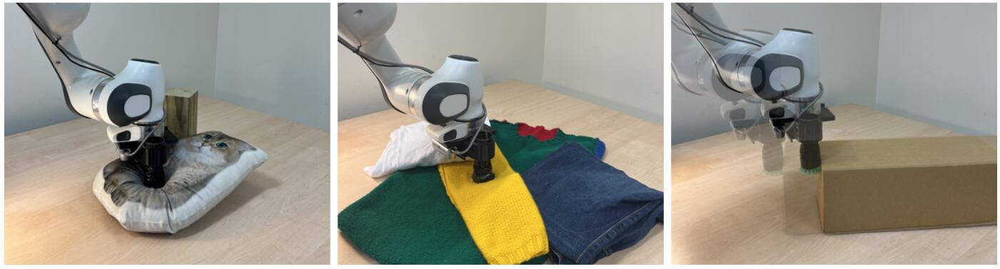

# RobEx

RobEx is the first fully-autonomous, neural-scene labeling robot experimenter. It is trained from scratch in real-time and is capable of operating in the real world. The autonomous robot experimenter discovers and maps dense physical scene properties by providing the outcomes of sparse experiments -- such as a poke, spectroscopy measurement, or lateral push -- to a 3D neural field.



## Pre-requisites
### Headless Open3D
Open3D must be built from source with headless rendering enabled. Instructions can be found [here](http://www.open3d.org/docs/latest/tutorial/Advanced/headless_rendering.html).

## Installation

```bash
make install
```

## Usage

```bash
source .anaconda/bin/activate
cd RobEx/train/examples
```

#### Online demo
```bash
./parallel_train.py --config "config_file.json"
```

It is preferable to run in two GPU setup, but can be run with single GPU (`--single_gpu`) with slower rendering framerate.

Flags:
* `--live`: Run from live kinect camera.
* `--do_sem`: Enable semantic labeling.
* `--poke`: Interact by poking
* `--push`: Interact by pushing
* `--spec`: Interact with spectroscopy
